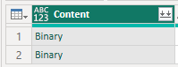

# Configure PowerBI to get files from a Sharepoint Folder

Here is a quick ref guide about how to configure PowerBI to get data (Excel files in this example) from a Sharepoint Folder. These data can be any files like CSV, Excel, JSON, XML, etc.

## 1. Get the Sharepoint Folder URL

First, you need to get the URL of the Sharepoint Site. If you already know the URL of your Sharepoint site, just copy it on the clipboard and go to Step 2 below. 

If you wish to use the Sharepoint site corresponding to your a team you created on Microsoft Teams, to retrieve the corresponding URL of the associated Sharepoint site, follow these steps:

1- select the "Teams" icon on the menu bar

2- click on the General (or any other) channel of your team

3- click on the "Files" tab of your team, 

4- then click on the "Open in Sharepoint" button.


This will open a browser to the corresponding Teams Sharepoint site:


> NOTE: For this example, I'll also create a folder on this site, where I'll put the files I want to use with PowerBI later:
> 
> And I will put a couple of excel files in this folder, it's important that these files have the same headers, and the same data types for our example.

Now from the address bar, take the base name of your site, which corresponds to the URL up to the forward slash before the word "Shared Documents". 


In this example, the URL is:

```https://canadadrey.sharepoint.com/sites/MyNewTeam2023/```

## 2. Configure PowerBI to get data from the Sharepoint Folder

1- Open PowerBI Desktop

2- Select "Get Data" from the menu bar


3- click on "More..." to get the list of all available data sources


4- Select "Sharepoint Folder" from the list of available data sources, and click on "Connect"


5- Paste the URL of the Sharepoint site you copied in Part 1 above, and click on "OK"


6- Choose the authentication method. In this example, I'll use the "Microsoft Account" option, and click the "Sign in" button


7- Click on the proper credentials to connect to the Sharepoint site, note the "Sign in" button changed to "Sign in as different user". Then click the "Connect" button


8- A new window will appear with all the content of the Sharepoint site


> NOTE: PowerBI will list all the files only in the Sharepoint site content. On this exmaple, we just have our 2 excel files in the FinanceFiles folder. The next steps will enable to view the folders as well.

9- Click "Transform Data" button to start the Power Query Editor, you will see the following window:


10- Now focus on the PowerQuery formula bar


11- In the formula bar, you'll see the following formula:
```powershell
= SharePoint.Files("https://TeamsSiteName.sharepoint.com/sites/MyNewTeam2023/", [ApiVersion = 15])
```

replace "Files" with "Contents" and validate the formula.

```powershell
= SharePoint.Contents("https://TeamsSiteName.sharepoint.com/sites/MyNewTeam2023/", [ApiVersion = 15])
```
it will look like the following in the formula bar (with the name of my test tenant instead of "TeamsSiteName"):


Now you will see the list of all the files, folders and elements in the Sharepoint site content:


Locate the row showing "Shared Documents":


and click on the "Table" item of the "Content" column, which will expand the content of the "Shared Documents" folder:


Choose the item corresponding to Teams channel where you created the folder in Part 1 above, in this example, we created the "FinanceFiles" folder under the "General" teams channel. So we'll click on the **Table** link next to "General" (or whatever the name of your channel:


Here you'll see our **FinancialFiles** folder:


click again on the **"Table"** link next to **"FinancialFiles"** and you'll see the list of files in this folder:


Click on the "Combine Files" button from the "Content" column:


In case you don't see it right away, it is the double-arrow button on the right of the "Content" column header:


Wait for PowerBI to process the files, and you'll see the following window:


Select either the table ("financials" in our example), or the Sheet ("Sheet1" in our example), and click on the "OK" button

> **NOTE**: all the files in your directory must have a table named "financials" (if you chose to combine the tables) or a sheet named "Sheet1" (if you chose to combine the whole data on the Sheet) to enable PowerBI to combine the data of all the files in a single table.
>
> Same thing if you want to use  CSV files instead of Excel files, all the files must have the same headers, and the same data types for the columns.


Click "Ok", and wait for PowerBI to process the query. You'll see the following window:


Click "Close and Apply" on the PowerBI menu on the top left corner:


You'll see PBI processing the query, and you'll see the following window:


And you will be able to start working with your data in PowerBI:


Expand the table on the far right of the PBI window to see the list of fields:


Start placing your visuals on the PBI canvas:


At this point, every time you update the files or add new files (with the same structure), you can refresh the data in PowerBI, and it will automatically get the new data from the Sharepoint folder !

> NOTE: I recomment you watch Wyn Hopkins' video on Youtube, which explains the same process, but with PowerQuery used in Excel: https://www.youtube.com/watch?v=-XE7HEZbQiY.
>
> Wyn is using a few tricks that makes the process clearer to understand, and makes it also easier to change the destination folder in case you want to move your files in a different folder  in Sharepoint.